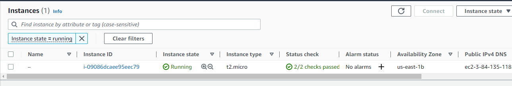

# CloudFormation - Lab \#1

## Create the Stack

```yaml
Resources:
  Ec2Instance:
    Type: AWS::EC2::Instance
    Properties:
      InstanceType: t2.micro
      ImageId: ami-467ca739 # Amazon Linux AMI in N.Virginia
      Tags:
        - Key: Name
          Value: A simple exampleU
```


## Update the Stack

```yaml
Resources:
  Ec2Instance:
    Type: AWS::EC2::Instance
    Properties:
      InstanceType: t2.micro
      ImageId: ami-467ca739 # Amazon Linux AMI in N.Virginia
      Tags:
        - Key: Name
          Value: A simple example
        - Key: Description
          Value: A simple stack update
```




