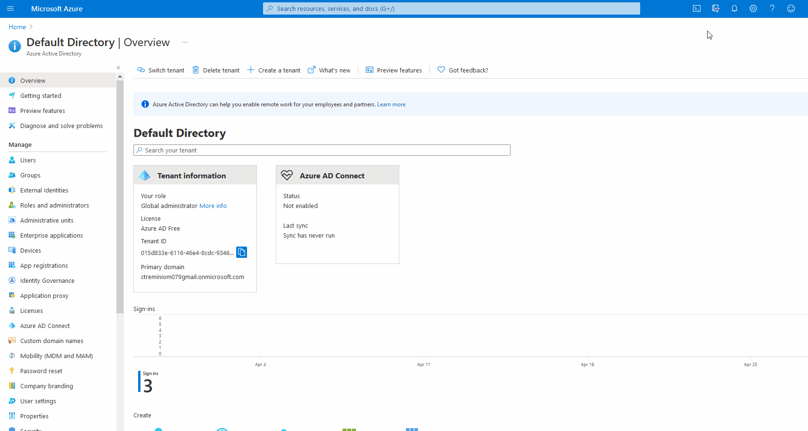

# 📓 Manage Azure AD Users

## Overview

Azure Active Directory **\(Azure AD\)** is Microsoft’s cloud-based identity and access management service, which helps your employees sign in and access resources in:

* External resources, such as Microsoft 365, the Azure portal, and thousands of other SaaS applications.
* Internal resources, such as apps on your corporate network and intranet, along with any cloud apps developed by your own organization.

## Features

1. It's an Active Directoruy in the Azure Cloud.
2. Manage users, groups, app, and security principals.
3. It can be linked to on-prem Active Directories.
4. GUI Management
5. Command-line management such as Powershell or azure-cli.


## Identity and Access Management \(IAM\)

### Authentication

* Proof of indentity.
* Single factor - Username, password.
* Multi-factor - Username, password, smartcard.

### Authorization

* Controlled access to resources.
* There're permissions or policies assigned to groups.

### Azure AD Security

It's a centralized is a centralazed repository of credentials, like.

* RBAC Role \(a collection of permissions\).
* Condition Access.
* Access Reviews.
* Multi-Factor Authentication.
* Privileded Identity Management \(PIM\).


**Tenant** = An Azure Active Directory instance.



## Azure CLI



```javascript
[
  {
    "cloudName": "AzureCloud",
    "homeTenantId": "015d833e-6116-46e4-8cdc-934661223874",
    "id": "edea1940-2666-4135-958c-260de343efa8",
    "isDefault": true,
    "managedByTenants": [],
    "name": "Azure for Students",
    "state": "Enabled",
    "tenantId": "015d833e-6116-46e4-8cdc-934661223874",
    "user": {
      "cloudShellID": true,
      "name": "live.com#ctreminiom079@gmail.com",
      "type": "user"
    }
  },
  {
    "cloudName": "AzureCloud",
    "homeTenantId": "015d833e-6116-46e4-8cdc-934661223874",
    "id": "6819e7c3-a625-47c1-b352-8db014ae1236",
    "isDefault": false,
    "managedByTenants": [],
    "name": "Azure subscription 1",
    "state": "Enabled",
    "tenantId": "015d833e-6116-46e4-8cdc-934661223874",
    "user": {
      "cloudShellID": true,
      "name": "live.com#ctreminiom079@gmail.com",
      "type": "user"
    }
  }
]
```

The subscription is associated with the Azure ID Tenant.


### Commands

```bash
carlos@Azure:~$ az ad -h

Group
    az ad : Manage Azure Active Directory Graph entities needed for Role Based Access Control.

Subgroups:
    app            : Manage applications with AAD Graph.
    group          : Manage Azure Active Directory groups.
    signed-in-user : Show graph information about current signed-in user in CLI.
    sp             : Manage Azure Active Directory service principals for automation authentication.
    user           : Manage Azure Active Directory users and user authentication.

Examples
    Delete a group from the directory. (autogenerated)
        az ad group delete --group MyGroupDisplayName


    Create a service principal. (autogenerated)
        az ad sp create --id 00000000-0000-0000-0000-00000000000000000


    update an application's group membership claims to "All" (autogenerated)
        az ad app update --id 00000000-0000-0000-0000-00000000000000000 --set
        groupMembershipClaims=All


    Create a web application, web API or native application. (autogenerated)
        az ad app create --available-to-other-tenants true --display-name my-native --password
        {password}


For more specific examples, use: az find "az ad"

Please let us know how we are doing: https://aka.ms/azureclihats
carlos@Azure:~$
```

| Commands Available | Description |
| :--- | :--- |
|  [az ad app](https://docs.microsoft.com/en-us/cli/azure/ad/app?view=azure-cli-latest) | Manage applications with AAD Graph. |
|  [az ad app create](https://docs.microsoft.com/en-us/cli/azure/ad/app?view=azure-cli-latest#az_ad_app_create) | Create a web application, web API, or native application. |
|  [az ad app credential](https://docs.microsoft.com/en-us/cli/azure/ad/app/credential?view=azure-cli-latest) | Manage an application's password or certificate credentials. |
|  [az ad app credential delete](https://docs.microsoft.com/en-us/cli/azure/ad/app/credential?view=azure-cli-latest#az_ad_app_credential_delete) | Delete an application's password or certificate credentials. |
|  [az ad app credential list](https://docs.microsoft.com/en-us/cli/azure/ad/app/credential?view=azure-cli-latest#az_ad_app_credential_list) | List an application's password or certificate credential metadata. \(The content of the password or certificate credential is not retrievable.\). |
|  [az ad app credential reset](https://docs.microsoft.com/en-us/cli/azure/ad/app/credential?view=azure-cli-latest#az_ad_app_credential_reset) | Append or overwrite an application's password or certificate credentials. |
|  [az ad app delete](https://docs.microsoft.com/en-us/cli/azure/ad/app?view=azure-cli-latest#az_ad_app_delete) | Delete an application. |
|  [az ad app list](https://docs.microsoft.com/en-us/cli/azure/ad/app?view=azure-cli-latest#az_ad_app_list) | List applications. |
|  [az ad app owner](https://docs.microsoft.com/en-us/cli/azure/ad/app/owner?view=azure-cli-latest) | Manage application owners. |
|  [az ad app owner add](https://docs.microsoft.com/en-us/cli/azure/ad/app/owner?view=azure-cli-latest#az_ad_app_owner_add) | Add an application owner. |
|  [az ad app owner list](https://docs.microsoft.com/en-us/cli/azure/ad/app/owner?view=azure-cli-latest#az_ad_app_owner_list) | List application owners. |
|  [az ad app owner remove](https://docs.microsoft.com/en-us/cli/azure/ad/app/owner?view=azure-cli-latest#az_ad_app_owner_remove) | Remove an application owner. |
|  [az ad app permission](https://docs.microsoft.com/en-us/cli/azure/ad/app/permission?view=azure-cli-latest) | Manage an application's OAuth2 permissions. |
|  [az ad app permission add](https://docs.microsoft.com/en-us/cli/azure/ad/app/permission?view=azure-cli-latest#az_ad_app_permission_add) | Add an API permission. |
|  [az ad app permission admin-consent](https://docs.microsoft.com/en-us/cli/azure/ad/app/permission?view=azure-cli-latest#az_ad_app_permission_admin_consent) | Grant Application & Delegated permissions through admin-consent. |
|  [az ad app permission delete](https://docs.microsoft.com/en-us/cli/azure/ad/app/permission?view=azure-cli-latest#az_ad_app_permission_delete) | Remove an API permission. |
|  [az ad app permission grant](https://docs.microsoft.com/en-us/cli/azure/ad/app/permission?view=azure-cli-latest#az_ad_app_permission_grant) | Grant the app an API Delegated permissions. |
|  [az ad app permission list](https://docs.microsoft.com/en-us/cli/azure/ad/app/permission?view=azure-cli-latest#az_ad_app_permission_list) | List API permissions the application has requested. |
|  [az ad app permission list-grants](https://docs.microsoft.com/en-us/cli/azure/ad/app/permission?view=azure-cli-latest#az_ad_app_permission_list_grants) | List Oauth2 permission grants. |
|  [az ad app show](https://docs.microsoft.com/en-us/cli/azure/ad/app?view=azure-cli-latest#az_ad_app_show) | Get the details of an application. |
|  [az ad app update](https://docs.microsoft.com/en-us/cli/azure/ad/app?view=azure-cli-latest#az_ad_app_update) | Update an application. |
|  [az ad ds](https://docs.microsoft.com/en-us/cli/azure/ad/ds?view=azure-cli-latest) | Manage domain service with azure active directory. |
|  [az ad ds create](https://docs.microsoft.com/en-us/cli/azure/ad/ds?view=azure-cli-latest#az_ad_ds_create) | Create a new domain service with the specified parameters. |
|  [az ad ds delete](https://docs.microsoft.com/en-us/cli/azure/ad/ds?view=azure-cli-latest#az_ad_ds_delete) | The Delete Domain Service operation deletes an existing Domain Service. |
|  [az ad ds list](https://docs.microsoft.com/en-us/cli/azure/ad/ds?view=azure-cli-latest#az_ad_ds_list) | List domain services in resource group or in subscription. |
|  [az ad ds show](https://docs.microsoft.com/en-us/cli/azure/ad/ds?view=azure-cli-latest#az_ad_ds_show) | Get the specified domain service. |
|  [az ad ds update](https://docs.microsoft.com/en-us/cli/azure/ad/ds?view=azure-cli-latest#az_ad_ds_update) | Update the existing deployment properties for domain service. |
|  [az ad ds wait](https://docs.microsoft.com/en-us/cli/azure/ad/ds?view=azure-cli-latest#az_ad_ds_wait) | Place the CLI in a waiting state until a condition of the ad ds is met. |
|  [az ad group](https://docs.microsoft.com/en-us/cli/azure/ad/group?view=azure-cli-latest) | Manage Azure Active Directory groups. |
|  [az ad group create](https://docs.microsoft.com/en-us/cli/azure/ad/group?view=azure-cli-latest#az_ad_group_create) | Create a group in the directory. |
|  [az ad group delete](https://docs.microsoft.com/en-us/cli/azure/ad/group?view=azure-cli-latest#az_ad_group_delete) | Delete a group from the directory. |
|  [az ad group get-member-groups](https://docs.microsoft.com/en-us/cli/azure/ad/group?view=azure-cli-latest#az_ad_group_get_member_groups) | Gets a collection of object IDs of groups of which the specified group is a member. |
|  [az ad group list](https://docs.microsoft.com/en-us/cli/azure/ad/group?view=azure-cli-latest#az_ad_group_list) | List groups in the directory. |
|  [az ad group member](https://docs.microsoft.com/en-us/cli/azure/ad/group/member?view=azure-cli-latest) | Manage Azure Active Directory group members. |
|  [az ad group member add](https://docs.microsoft.com/en-us/cli/azure/ad/group/member?view=azure-cli-latest#az_ad_group_member_add) | Add a member to a group. |
|  [az ad group member check](https://docs.microsoft.com/en-us/cli/azure/ad/group/member?view=azure-cli-latest#az_ad_group_member_check) | Check if a member is in a group. |
|  [az ad group member list](https://docs.microsoft.com/en-us/cli/azure/ad/group/member?view=azure-cli-latest#az_ad_group_member_list) | Gets the members of a group. |
|  [az ad group member remove](https://docs.microsoft.com/en-us/cli/azure/ad/group/member?view=azure-cli-latest#az_ad_group_member_remove) | Remove a member from a group. |
|  [az ad group owner](https://docs.microsoft.com/en-us/cli/azure/ad/group/owner?view=azure-cli-latest) | Manage Azure Active Directory group owners. |
|  [az ad group owner add](https://docs.microsoft.com/en-us/cli/azure/ad/group/owner?view=azure-cli-latest#az_ad_group_owner_add) | Add a group owner. |
|  [az ad group owner list](https://docs.microsoft.com/en-us/cli/azure/ad/group/owner?view=azure-cli-latest#az_ad_group_owner_list) | List group owners. |
|  [az ad group owner remove](https://docs.microsoft.com/en-us/cli/azure/ad/group/owner?view=azure-cli-latest#az_ad_group_owner_remove) | Remove a group owner. |
|  [az ad group show](https://docs.microsoft.com/en-us/cli/azure/ad/group?view=azure-cli-latest#az_ad_group_show) | Gets group information from the directory. |
|  [az ad signed-in-user](https://docs.microsoft.com/en-us/cli/azure/ad/signed-in-user?view=azure-cli-latest) | Show graph information about current signed-in user in CLI. |
|  [az ad signed-in-user list-owned-objects](https://docs.microsoft.com/en-us/cli/azure/ad/signed-in-user?view=azure-cli-latest#az_ad_signed_in_user_list_owned_objects) | Get the list of directory objects that are owned by the user. |
|  [az ad signed-in-user show](https://docs.microsoft.com/en-us/cli/azure/ad/signed-in-user?view=azure-cli-latest#az_ad_signed_in_user_show) | Gets the details for the currently logged-in user. |
|  [az ad sp](https://docs.microsoft.com/en-us/cli/azure/ad/sp?view=azure-cli-latest) | Manage Azure Active Directory service principals for automation authentication. |
|  [az ad sp create](https://docs.microsoft.com/en-us/cli/azure/ad/sp?view=azure-cli-latest#az_ad_sp_create) | Create a service principal. |
|  [az ad sp create-for-rbac](https://docs.microsoft.com/en-us/cli/azure/ad/sp?view=azure-cli-latest#az_ad_sp_create_for_rbac) | Create a service principal and configure its access to Azure resources. |
|  [az ad sp credential](https://docs.microsoft.com/en-us/cli/azure/ad/sp/credential?view=azure-cli-latest) | Manage a service principal's credentials. |
|  [az ad sp credential delete](https://docs.microsoft.com/en-us/cli/azure/ad/sp/credential?view=azure-cli-latest#az_ad_sp_credential_delete) | Delete a service principal's credential. |
|  [az ad sp credential list](https://docs.microsoft.com/en-us/cli/azure/ad/sp/credential?view=azure-cli-latest#az_ad_sp_credential_list) | List a service principal's credentials. |
|  [az ad sp credential reset](https://docs.microsoft.com/en-us/cli/azure/ad/sp/credential?view=azure-cli-latest#az_ad_sp_credential_reset) | Reset a service principal credential. |
|  [az ad sp delete](https://docs.microsoft.com/en-us/cli/azure/ad/sp?view=azure-cli-latest#az_ad_sp_delete) | Delete a service principal and its role assignments. |
|  [az ad sp list](https://docs.microsoft.com/en-us/cli/azure/ad/sp?view=azure-cli-latest#az_ad_sp_list) | List service principals. |
|  [az ad sp owner](https://docs.microsoft.com/en-us/cli/azure/ad/sp/owner?view=azure-cli-latest) | Manage service principal owners. |
|  [az ad sp owner list](https://docs.microsoft.com/en-us/cli/azure/ad/sp/owner?view=azure-cli-latest#az_ad_sp_owner_list) | List service principal owners. |
|  [az ad sp show](https://docs.microsoft.com/en-us/cli/azure/ad/sp?view=azure-cli-latest#az_ad_sp_show) | Get the details of a service principal. |
|  [az ad sp update](https://docs.microsoft.com/en-us/cli/azure/ad/sp?view=azure-cli-latest#az_ad_sp_update) | Update a service principal. |
|  [az ad user](https://docs.microsoft.com/en-us/cli/azure/ad/user?view=azure-cli-latest) | Manage Azure Active Directory users and user authentication. |
|  [az ad user create](https://docs.microsoft.com/en-us/cli/azure/ad/user?view=azure-cli-latest#az_ad_user_create) | Create an Azure Active Directory user. |
|  [az ad user delete](https://docs.microsoft.com/en-us/cli/azure/ad/user?view=azure-cli-latest#az_ad_user_delete) | Delete a user. |
|  [az ad user get-member-groups](https://docs.microsoft.com/en-us/cli/azure/ad/user?view=azure-cli-latest#az_ad_user_get_member_groups) | Get groups of which the user is a member. |
|  [az ad user list](https://docs.microsoft.com/en-us/cli/azure/ad/user?view=azure-cli-latest#az_ad_user_list) | List Azure Active Directory users. |
|  [az ad user show](https://docs.microsoft.com/en-us/cli/azure/ad/user?view=azure-cli-latest#az_ad_user_show) | Gets user information from the directory. |
|  [az ad user update](https://docs.microsoft.com/en-us/cli/azure/ad/user?view=azure-cli-latest#az_ad_user_update) | Update Azure Active Directory users. |



```bash
PS /home/carlos> az ad signed-in-user -h

Group
    az ad signed-in-user : Show graph information about current signed-in user in CLI.

Commands:
    list-owned-objects : Get the list of directory objects that are owned by the user.
    show               : Gets the details for the currently logged-in user.

For more specific examples, use: az find "az ad signed-in-user"

Please let us know how we are doing: https://aka.ms/azureclihats
PS /home/carlos> az ad signed-in-user show
{
  "accountEnabled": true,
  "ageGroup": null,
  "assignedLicenses": [],
  "assignedPlans": [],
  "city": null,
  "companyName": null,
  "consentProvidedForMinor": null,
  "country": null,
  "createdDateTime": "2021-04-30T21:30:52Z",
  "creationType": null,
  "deletionTimestamp": null,
  "department": null,
  "dirSyncEnabled": null,
  "displayName": "Carlos Treminio",
  "employeeId": null,
  "facsimileTelephoneNumber": null,
  "givenName": "Carlos",
  "immutableId": null,
  "isCompromised": null,
  "jobTitle": null,
  "lastDirSyncTime": null,
  "legalAgeGroupClassification": null,
  "mail": null,
  "mailNickname": "ctreminiom079_gmail.com#EXT#",
  "mobile": null,
  "objectId": "051a6a52-aeb0-4844-a238-11b2a145b415",
  "objectType": "User",
  "odata.metadata": "https://graph.windows.net/015d833e-6116-46e4-8cdc-934661223874/$metadata#directoryObjects/@Element",
  "odata.type": "Microsoft.DirectoryServices.User",
  "onPremisesDistinguishedName": null,
  "onPremisesSecurityIdentifier": null,
  "otherMails": [
    "ctreminiom079@gmail.com"
  ],
  "passwordPolicies": null,
  "passwordProfile": null,
  "physicalDeliveryOfficeName": null,
  "postalCode": null,
  "preferredLanguage": "en",
  "provisionedPlans": [],
  "provisioningErrors": [],
  "proxyAddresses": [],
  "refreshTokensValidFromDateTime": "2021-04-30T21:30:52Z",
  "showInAddressList": null,
  "signInNames": [],
  "sipProxyAddress": null,
  "state": null,
  "streetAddress": null,
  "surname": "Treminio",
  "telephoneNumber": null,
  "thumbnailPhoto@odata.mediaEditLink": "directoryObjects/051a6a52-aeb0-4844-a238-11b2a145b415/Microsoft.DirectoryServices.User/thumbnailPhoto",
  "usageLocation": "CR",
  "userIdentities": [],
  "userPrincipalName": "ctreminiom079_gmail.com#EXT#@ctreminiom079gmail.onmicrosoft.com",
  "userState": null,
  "userStateChangedOn": null,
  "userType": "Member"
}
PS /home/carlos>
```



```
PS /home/carlos> az ad group list --query [].displayName
[
  "Group Dummy"
]
PS /home/carlos>
```



### Powershell Commands

 Azure PowerShell is designed for managing and administering Azure resources from the command line. Use Azure PowerShell when you want to build automated tools that use the Azure Resource Manager model. Try it out in your browser with [Azure Cloud Shell](https://docs.microsoft.com/en-us/azure/cloud-shell/overview), or install it on your local machine.

#### Find commands

Azure PowerShell cmdlets follow a standard naming convention for PowerShell, `Verb-Noun`. The verb describes the action \(examples include `New`, `Get`, `Set`, `Remove`\) and the noun describes the resource type \(examples include `AzVM`, `AzKeyVaultCertificate`, `AzFirewall`, `AzVirtualNetworkGateway`\). Nouns in Azure PowerShell always start with the prefix `Az`. For the full list of standard verbs, see [Approved verbs for PowerShell Commands](https://docs.microsoft.com/en-us/powershell/scripting/developer/cmdlet/approved-verbs-for-windows-powershell-commands).



```bash
PS /home/carlos> get-command get*azad*

CommandType     Name                                               Version    Source
-----------     ----                                               -------    ------
Alias           Get-AzADServicePrincipalCredential                 3.4.1      Az.Resources
Cmdlet          Get-AzADAppCredential                              3.4.1      Az.Resources
Cmdlet          Get-AzADApplication                                3.4.1      Az.Resources
Cmdlet          Get-AzADGroup                                      3.4.1      Az.Resources
Cmdlet          Get-AzADGroupMember                                3.4.1      Az.Resources
Cmdlet          Get-AzADServicePrincipal                           3.4.1      Az.Resources
Cmdlet          Get-AzADSpCredential                               3.4.1      Az.Resources
Cmdlet          Get-AzADUser                                       3.4.1      Az.Resources
Cmdlet          Get-AzAdvisorConfiguration                         1.1.1      Az.Advisor
Cmdlet          Get-AzAdvisorRecommendation                        1.1.1      Az.Advisor

PS /home/carlos>
```



```bash
PS /home/carlos>  Get-AzADGroup | select displayName

DisplayName
-----------
Group Dummy
```



```
PS /home/carlos>  Get-AzADGroup | get-member -type property

   TypeName: Microsoft.Azure.Commands.ActiveDirectory.PSADGroup

Name            MemberType Definition
----            ---------- ----------
Description     Property   string Description {get;set;}
DisplayName     Property   string DisplayName {get;set;}
Id              Property   string Id {get;set;}
MailNickname    Property   string MailNickname {get;set;}
ObjectType      Property   string ObjectType {get;}
SecurityEnabled Property   System.Nullable[bool] SecurityEnabled {get;set;}
Type            Property   string Type {get;set;}
```



