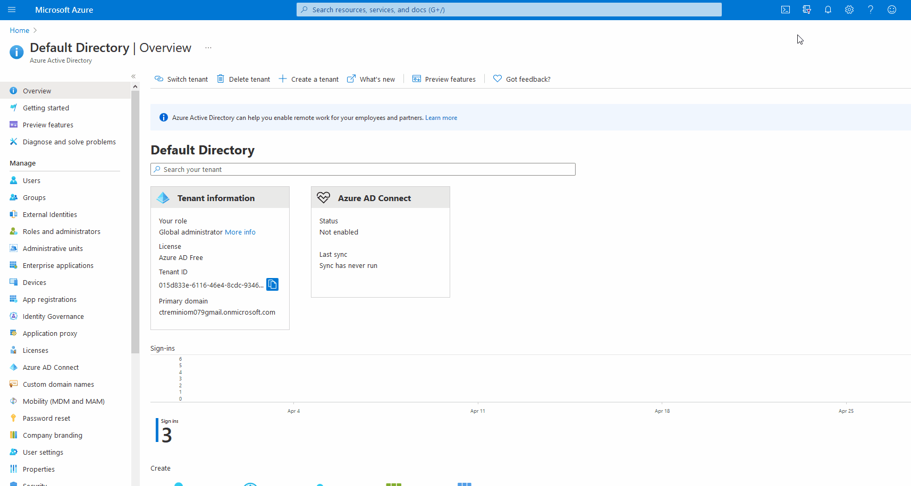

# 📓 Manage Azure AD Users

## Overview

Azure Active Directory **\(Azure AD\)** is Microsoft’s cloud-based identity and access management service, which helps your employees sign in and access resources in:

* External resources, such as Microsoft 365, the Azure portal, and thousands of other SaaS applications.
* Internal resources, such as apps on your corporate network and intranet, along with any cloud apps developed by your own organization.

## Features

1. It's an Active Directoruy in the Azure Cloud.
2. Manage users, groups, app, and security principals.
3. It can be linked to on-prem Active Directories.
4. GUI Management
5. Command-line management such as Powershell or azure-cli.


## Identity and Access Management \(IAM\)

### Authentication

* Proof of indentity.
* Single factor - Username, password.
* Multi-factor - Username, password, smartcard.

### Authorization

* Controlled access to resources.
* There're permissions or policies assigned to groups.

### Azure AD Security

It's a centralized is a centralazed repository of credentials, like.

* RBAC Role \(a collection of permissions\).
* Condition Access.
* Access Reviews.
* Multi-Factor Authentication.
* Privileded Identity Management \(PIM\).


**Tenant** = An Azure Active Directory instance.



## Azure CLI



```javascript
[
  {
    "cloudName": "AzureCloud",
    "homeTenantId": "015d833e-6116-46e4-8cdc-934661223874",
    "id": "edea1940-2666-4135-958c-260de343efa8",
    "isDefault": true,
    "managedByTenants": [],
    "name": "Azure for Students",
    "state": "Enabled",
    "tenantId": "015d833e-6116-46e4-8cdc-934661223874",
    "user": {
      "cloudShellID": true,
      "name": "live.com#ctreminiom079@gmail.com",
      "type": "user"
    }
  },
  {
    "cloudName": "AzureCloud",
    "homeTenantId": "015d833e-6116-46e4-8cdc-934661223874",
    "id": "6819e7c3-a625-47c1-b352-8db014ae1236",
    "isDefault": false,
    "managedByTenants": [],
    "name": "Azure subscription 1",
    "state": "Enabled",
    "tenantId": "015d833e-6116-46e4-8cdc-934661223874",
    "user": {
      "cloudShellID": true,
      "name": "live.com#ctreminiom079@gmail.com",
      "type": "user"
    }
  }
]
```

The subscription is associated with the Azure ID Tenant.


### Commands

```bash
carlos@Azure:~$ az ad -h

Group
    az ad : Manage Azure Active Directory Graph entities needed for Role Based Access Control.

Subgroups:
    app            : Manage applications with AAD Graph.
    group          : Manage Azure Active Directory groups.
    signed-in-user : Show graph information about current signed-in user in CLI.
    sp             : Manage Azure Active Directory service principals for automation authentication.
    user           : Manage Azure Active Directory users and user authentication.

Examples
    Delete a group from the directory. (autogenerated)
        az ad group delete --group MyGroupDisplayName


    Create a service principal. (autogenerated)
        az ad sp create --id 00000000-0000-0000-0000-00000000000000000


    update an application's group membership claims to "All" (autogenerated)
        az ad app update --id 00000000-0000-0000-0000-00000000000000000 --set
        groupMembershipClaims=All


    Create a web application, web API or native application. (autogenerated)
        az ad app create --available-to-other-tenants true --display-name my-native --password
        {password}


For more specific examples, use: az find "az ad"

Please let us know how we are doing: https://aka.ms/azureclihats
carlos@Azure:~$
```


