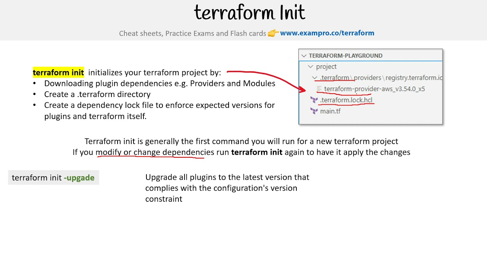
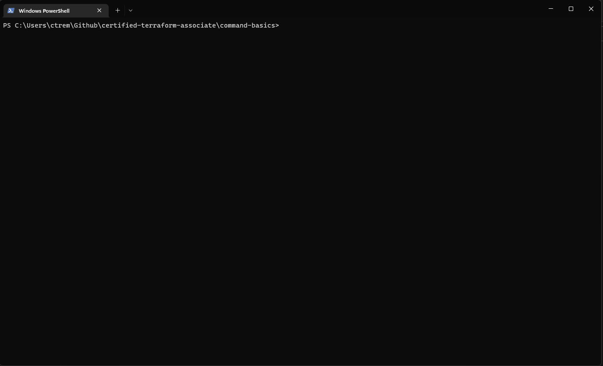
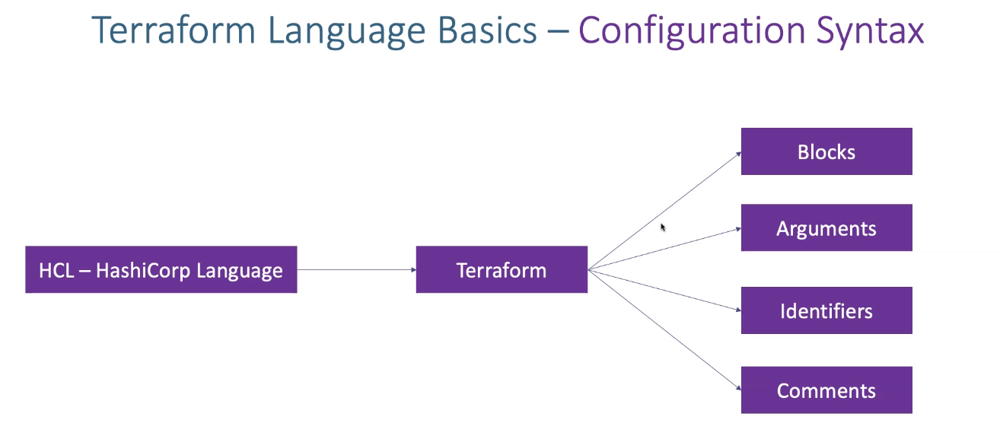
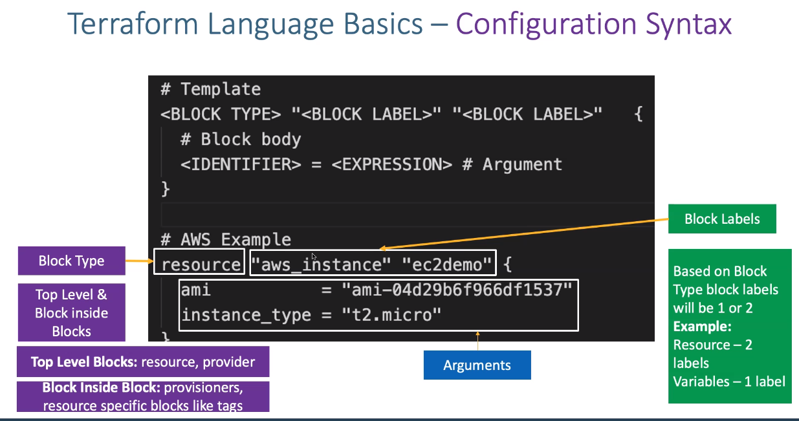

# 🔎 Overview

This guide lists resources you should study if you are preparing for the Terraform Associate Certification exam from scratch. We've listed the resources in order of difficulty so that you should be able to progress through the list in order. For resources related to a particular test objective, refer to the [Exam Review Guide](https://learn.hashicorp.com/tutorials/terraform/associate-review) instead.


Visit the [HashiCorp Cloud Engineer Certification](https://www.hashicorp.com/certification/terraform-associate/) page for information on the exam and to sign up.


## Learn about IaC

Terraform is a tool that allows you to define infrastructure in human and machine-readable code. Review the following resources to start learning about the advantages of Infrastructure as Code (IaC), and the advantages of Terraform specifically



## Terraform Workflow

.png>)

### Init

Terraform expects to be invoked from a working directory that contains configuration files written in [the Terraform language](https://developer.hashicorp.com/terraform/language). Terraform uses configuration content from this directory, and also uses the directory to store settings, cached plugins and modules, and sometimes state data.

A working directory must be initialized before Terraform can perform any operations in it (like provisioning infrastructure or modifying state).

* This commend is used to initialize a workflow directory containing terraform config files.
* This's the first command that should be run after writing new terraform configurations and **providers.**

<figure><figcaption></figcaption></figure>

Run the `terraform init` command to initialize a working directory that contains a Terraform configuration. After initialization, you will be able to perform other commands, like `terraform plan` and `terraform apply`.

If you try to run a command that relies on initialization without first initializing, the command will fail with an error and explain that you need to run init.

Initialization performs several tasks to prepare a directory, including accessing state in the configured backend, downloading and installing provider plugins, and downloading modules. Under some conditions (usually when changing from one backend to another), it might ask the user for guidance or confirmation.


Official Documentation


### Validate

The `terraform validate` command validates the configuration files in a directory, referring only to the configuration and not accessing any remote services such as remote state, provider APIs, etc.

Validate runs checks that verify whether a configuration is syntactically valid and internally consistent, regardless of any provided variables or existing state. It is thus primarily useful for general verification of reusable modules, including correctness of attribute names and value types.

* Validates the terraform configuration files in that respective directory to ensure they are **syntactically valid** and internally consistent.

It is safe to run this command automatically, for example as a post-save check in a text editor or as a test step for a re-usable module in a CI system.

Validation requires an initialized working directory with any referenced plugins and modules installed. To initialize a working directory for validation without accessing any configured backend, use

<figure><figcaption></figcaption></figure>


Official Documentation


### Plan

The `terraform plan` command creates an execution plan, which lets you preview the changes that Terraform plans to make to your infrastructure. By default, when Terraform creates a plan it:

* Reads the current state of any already-existing remote objects to make sure that the Terraform state is up-to-date.
* Compares the current configuration to the prior state and noting any differences.
* Proposes a set of change actions that should, if applied, make the remote objects match the configuration.
* Terraform performs a refresh and determinates what actions are necessary to achieve the **desired** **state** specified in the configuration files.

<figure><figcaption></figcaption></figure>


Official Documentation


### Apply

* Used to apply the changes required **to reach the desired state** of the configuration.
* By default, apply scans the current directory for the configuration and applies the changes appropriately.

<figure><figcaption></figcaption></figure>

<figure><figcaption></figcaption></figure>


Official Documentation


### Destroy

The `terraform destroy` command is a convenient way to destroy all remote objects managed by a particular Terraform configuration.

While you will typically not want to destroy long-lived objects in a production environment, Terraform is sometimes used to manage ephemeral infrastructure for development purposes, in which case you can use `terraform destroy` to conveniently clean up all of those temporary objects once you are finished with your work.


Official Documentation


## Terraform Workflow Sample



<figure><figcaption>
.tf files
</figcaption></figure>

<figure><figcaption></figcaption></figure>

<figure><figcaption></figcaption></figure>

<figure><figcaption></figcaption></figure>

<figure><figcaption></figcaption></figure>

## Terraform Language Syntax

This section describes the _native syntax_ of the Terraform language, which is a rich language designed to be relatively easy for humans to read and write. The constructs in the Terraform language can also be expressed in [JSON syntax](https://developer.hashicorp.com/terraform/language/syntax/json), which is harder for humans to read and edit but easier to generate and parse programmatically.

This low-level syntax of the Terraform language is defined in terms of a syntax called _HCL_, which is also used by configuration languages in other applications, and in particular other HashiCorp products. It is  not necessary to know all of the details of HCL syntax in order to use Terraform, and so this page summarizes the most important details. If you are interested, you can find a full definition of HCL syntax in [the HCL native syntax specification](https://github.com/hashicorp/hcl/blob/main/hclsyntax/spec.md).

<figure><figcaption></figcaption></figure>

<figure><figcaption></figcaption></figure>

## Terraform Top-Level Blocks

.png>)

## Terraform Providers Sample

.png>)

## Terraform Core Definitions

.png>)

## Terraform State Diagram

.png>)

.png>)

## Terraform Variables

.png>)

.png>)

## Terraform Backend

.png>)

.png>)

.png>)

.png>)

.png>)
